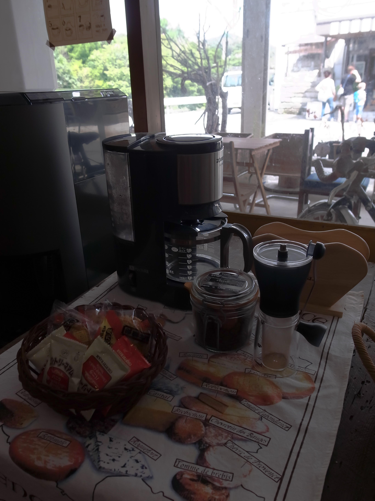
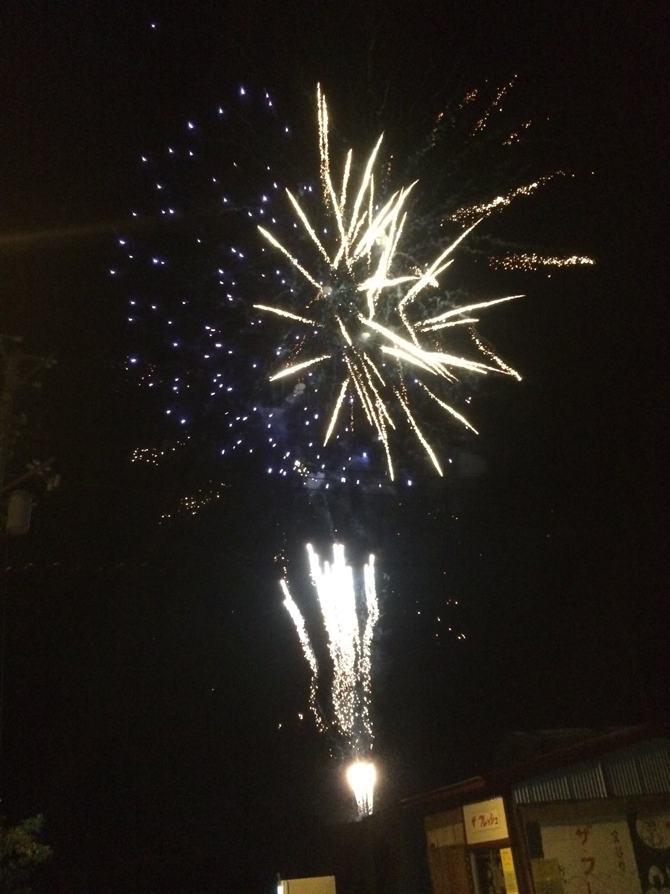
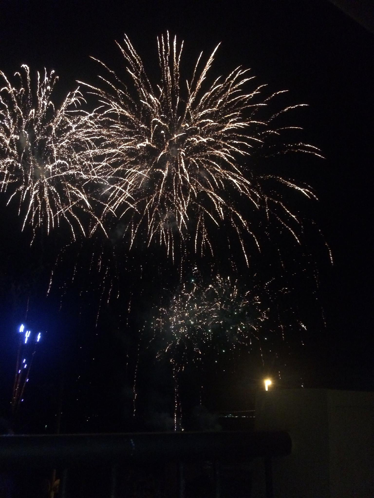

================================
 千葉・金谷で開発合宿やってきた
================================

コミュニティースペース「まるも」さんにお世話になった。利用したのは `開発合宿プラン｜千葉県金谷のまるもで開発合宿しませんか？`_ で WiFi はもちろん、宿の手配までお願いできた。いたれりつくせりである。

.. image:: R0018407.jpg

テラス的なのがあったり。

.. image:: R0018408.jpg

お菓子やコーヒーまで用意してもらったり。

貸切の作業スペースの広さは申し分なし。聞くところによると 15 名ほどでの作業も余裕とのこと。

.. image:: R0018422.jpg

偶然、花火大会と日程がかぶっていたのでついでに。

町の小さな花火大会だけど距離が近くてなかなかの迫力。

海の側の町なので海産物がおいしいとのことだったが今回はあまり食べられず。次の機会を楽しみにしよう。おわり。

.. author:: default
.. categories:: none
.. tags:: none
.. comments::

.. _`開発合宿プラン｜千葉県金谷のまるもで開発合宿しませんか？`: http://marumo.net/gasshuku-plan001/
